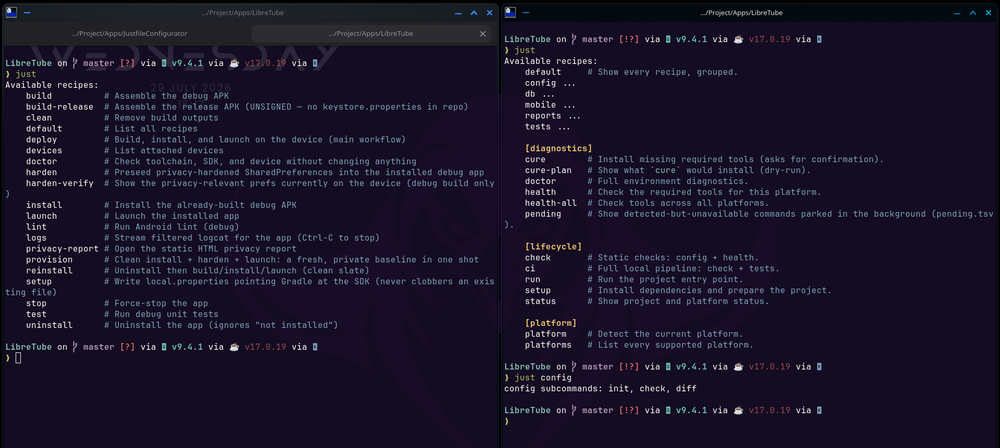

<h1 align="center">⚙️ JustfileConfigurator</h1>

<p align="center">
  A reusable, cross-platform <a href="https://just.systems"><code>just</code></a> template —
  and the tooling to <strong>validate</strong>, <strong>document</strong> and
  <strong>package</strong> it — so every project gets the same clean, self-documenting task runner.
</p>

<p align="center">
  
  
  
  
  
</p>

<p align="center">
  
</p>
<p align="center">
  <em>Before → after: a flat recipe dump becomes a grouped, self-documenting <code>just</code> menu.</em>
</p>

---

## Why

A `just`-based task runner tends to rot: OS-specific `if`s creep into recipes, tool checks
are copy-pasted, and the recipe list becomes an unsorted wall of text. JustfileConfigurator
fixes that with a strict **five-layer architecture** and a small tooling layer that keeps a
generated **HTML dashboard** in sync with the real files.

## Features

- 🧱 **Grouped, self-documenting recipes** — `just` prints a tidy `[lifecycle]` / `[platform]` / `[diagnostics]` menu.
- 🖥️ **Cross-platform by design** — Arch · Debian · macOS · Windows via OS *adapters*, using `[unix]`/`[windows]` attributes (no deprecated `windows-shell`).
- 📇 **Declarative manifests** — tools, commands, platforms and env vars live in TSV files; scripts and the dashboard read them, nothing is hand-duplicated.
- 🩺 **Health & cure** — `just health` audits required tools per OS; `just cure` installs the missing ones through the right package manager.
- 🅿️ **Background parking** — commands detected but not runnable are parked in `pending.tsv` (`just pending`) instead of becoming broken recipes.
- 📊 **Live dashboard** — `just docs-build` regenerates the searchable HTML view from the real tree + manifests.
- ♻️ **One-command reuse** — ship it as a dist archive or install the skill for Claude or Codex.

## Architecture

```text
Justfile                                  entry point (imports + mods)
   ↓  imports / mods
Functional modules (.just/modules)        WHAT to do
   ↓  dispatch
Bash / PowerShell scripts (.just/scripts)
   ↓  call
OS adapters (.just/adapters)              HOW to do it
   ↓  read
Declarative manifests (.just/manifests)   data, not code
```

Adapters map Arch→`pacman`, Debian→`apt-get`, macOS→`brew`, Windows→`winget`. OS logic lives
**only** in adapters + manifests — never in a module.

## Quick start

```bash
git clone <this-repo> && cd JustfileConfigurator
just              # configurator recipe list
just validate     # structure, references, manifests, syntax
just docs-serve   # open the dashboard at http://localhost:8000
```

## Configurator commands

| Command | Purpose |
|---|---|
| `just version` | Print the configurator version (from the `VERSION` file) |
| `just validate` | Check structure, references, TSV columns/order, Bash + JS syntax |
| `just docs-build` | Regenerate `docs/assets/project-data.js` from the real tree + manifests |
| `just docs-open` / `just docs-serve [PORT]` | Open / serve the dashboard |
| `just package [VERSION]` | Build dist archives (full project + template only); defaults to the `VERSION` file |
| `just install-skill` / `just uninstall-skill` | Install/remove the skill for **every detected agent** (Claude, Codex, …) |
| `just install-skill-claude` / `just uninstall-skill-claude` | …for **Claude only** |
| `just install-skill-codex` / `just uninstall-skill-codex` | …for **Codex only** |
| `just tree` / `just clean` | Print the template tree / remove archives |

## Template commands (inside a generated project)

Grouped for `just --list`:

| Group | Commands |
|---|---|
| **lifecycle** | `run` · `setup` · `check` · `ci` · `status` |
| **platform** | `platform` · `platforms` |
| **diagnostics** | `health` · `health-all` · `cure-plan` · `cure` · `doctor` · `pending` · `version` |
| **modules** | `config init｜check｜diff` · `db backup｜restore FILE｜reset` · `tests all` · `reports all` |
| **optional** (`mod?`) | `mobile` · `desktop` |

See [`template/README.md`](template/README.md) for details.

## Reuse — instantiate the template

All agent integrations are rendered from the same [`skill/SKILL.md`](skill/SKILL.md)
source. Re-run an install command whenever you want to refresh an installed copy.

**Install for every detected agent (recommended).**

```bash
just install-skill
```

This installs the skill into **each agent it finds** on the machine — Claude
(`~/.claude/skills`) and Codex (`~/.codex/skills`) — and skips any that aren't present.
`just uninstall-skill` removes it from all of them.

**Target a single agent.**

```bash
just install-skill-claude   # Claude only  (override root: CLAUDE_SKILLS_DIR)
just install-skill-codex    # Codex only   (override root: CODEX_SKILLS_DIR, or CODEX_HOME)
```

These force-install even if the agent isn't auto-detected — useful for a non-standard
skills root, e.g. `CODEX_SKILLS_DIR="$HOME/.agents/skills" just install-skill-codex`.

Once installed, ask **Claude** to use the `justfile-template` skill, or invoke it in
**Codex** with `$justfile-template`. The skill copies the scaffold **without clobbering**
your files (merges `.gitignore`, backs up an existing `Justfile`), **scans the project** to
wire the real `run`/`build`/`test`/`lint` commands into the structure, and **parks** anything
not runnable in `pending.tsv`. Each agent's copy is independent.

On **re-runs it only re-analyses what changed**: a dedicated, non-invasive git baseline
(`refs/heads/justfile-configurator/baseline`) plus a committed `.just/state/scan.json` let it
diff against the last run instead of re-scanning everything, and a **self-validation gate**
(`validate-generated.sh`) checks the generated Justfile, references, manifests, syntax and any
leftover `# TODO` before the skill reports back.

**Archive.**

```bash
just package 0.1.0
tar -xzf dist/justfile-template-0.1.0.tar.gz -C /path/to/new-project --strip-components=1
```

## Project layout

```text
JustfileConfigurator/
├── Justfile        # manage the configurator
├── docs/           # STRUCTURE.md + HTML dashboard (index.html, assets/)
├── scripts/        # validate.sh, docs-build.sh, package.sh, install-skill.sh, lib.sh
├── skill/          # shared SKILL.md source for Claude and Codex
├── tests/          # template and skill-installer smoke tests
├── dist/           # generated archives (git-ignored)
└── template/       # the distributable template
```

Full spec and the interactive view: [`docs/STRUCTURE.md`](docs/STRUCTURE.md) ·
[`docs/index.html`](docs/index.html).

## Status

Unix (Arch/Debian/macOS) is fully working and smoke-tested. Windows `.ps1` files are
documented placeholders; `just validate` flags native `just`-parse and `pwsh` smoke as
deferred to a future Linux/macOS/Windows CI matrix.

## Acknowledgments

Thanks to [Else00](https://github.com/Else00) for the suggestion.

## License

© 2026 Maggisano Aron. **All rights reserved.** Provided for **private, personal,
non-commercial** use only. 
**Commercial use requires prior written permission**. 
See [`LICENSE`](LICENSE) for the full terms.
